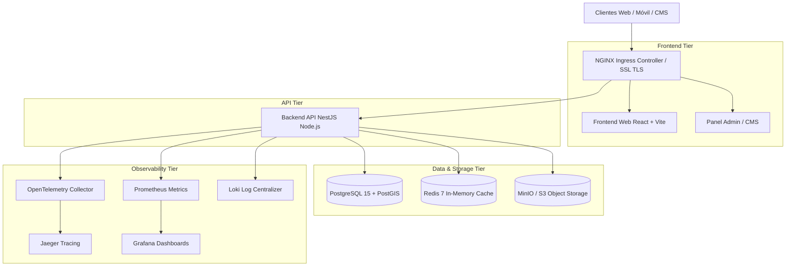

# Arquitectura del Sistema — Sembrando Huellas Perú (Enterprise)

## Resumen Ejecutivo

**Sembrando Huellas Perú** es una plataforma tecnológica integral para la gestión ambiental, reforestación, educación climática y toma de decisiones basadas en inteligencia ambiental. La arquitectura está diseñada bajo patrones de microservicios desacoplados, contenedorizados y orientados a eventos, garantizando alta disponibilidad, tolerancia a fallos y escalabilidad horizontal.

---

## Componentes de la Arquitectura

### 1. Frontend SPA (`sembrando-huellas`)
- **Tecnología:** React 19, TypeScript 5.5, Vite 8, Tailwind CSS, Framer Motion, TanStack Query, i18next.
- **Función:** Portal público, catálogo interactivo de especies, calculadora de huella de carbono, mapa interactivo GIS, módulos de educación ambiental e integración con el módulo Admin/CMS.

### 2. Backend Enterprise API (`sembrando-huellas-backend`)
- **Tecnología:** NestJS 10, TypeScript 5.5, Prisma ORM 5.18, Express, Helmet, Class-Validator, Throttler.
- **Módulos Principales:**
  - `AuthModule` & `PermissionsModule`: Autenticación JWT, RBAC y auditoría.
  - `EISModule` & `SIAModule`: Intelligence Suite & Sistema Inteligente de Información Ambiental.
  - `AIModule`: Integración con OpenAI, Anthropic Claude y Google Gemini.
  - `ProjectsModule`, `VolunteersModule`, `DonationsModule`: Gestión de impacto social.

### 3. Base de Datos Racional & GIS (`PostgreSQL` + `PostGIS`)
- **Almacenamiento:** Datos relacionales con índices espaciales PostGIS para coordenadas geográficas de zonas de reforestación y especies.

### 4. Caché de Alto Rendimiento (`Redis`)
- **Propósito:** Caché de respuestas de consultas recurrentes, limitación de tasa de peticiones (Rate Limiting) y sesiones activas.

### 5. Almacenamiento de Objetos (`MinIO / S3`)
- **Propósito:** Almacenamiento de imágenes de evidencias, archivos multimedia, documentos públicos y respaldos.
